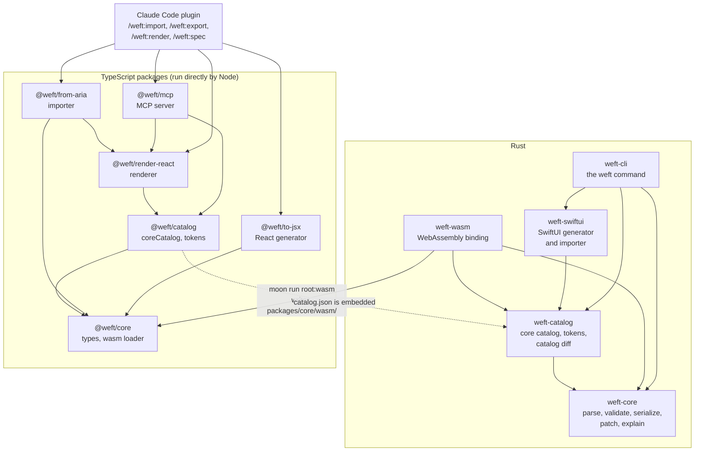

# How it works

Weft is a specification plus a set of small programs that all agree on it. This page shows what the programs are, how they depend on each other and what happens to a screen when you use one of them. You do not need it to use Weft, but it helps when something surprises you.

## The pieces



**Rust holds the rules.** `crates/weft-core` reads and writes the markup, converts it to canonical JSON, validates it, applies patches and reads bindings back as sentences. `crates/weft-catalog` adds the core catalog, the design token loader and a tool that tells you whether a catalog change is major, minor or none. Neither crate does any input or output, so the same code runs in a terminal and in WebAssembly.

**Two doors into the same code.** `crates/weft-cli` is the `weft` program (`validate`, `fmt`, `explain`, `swiftui` and `import-swiftui` from `crates/weft-swiftui`, and `html`, `react`, `solid` and their importers from `crates/weft-web`). `crates/weft-wasm` compiles the same crates to WebAssembly; `moon run root:wasm` writes the result to `packages/core/wasm/` (generated, never committed). `@weft/core` and `@weft/catalog` load it and keep ordinary TypeScript function names, so a TypeScript program calls `parse` or `validate` and the Rust code runs. There is no second implementation of the rules.

**TypeScript holds everything around the rules.** The packages have no build step; Node runs the `.ts` files directly. `@weft/core` has the types and the loader, `@weft/catalog` has the core catalog as data and the token helpers, and each of the others does one job: render a screen, import a page, generate React, serve tools over MCP. The plugin glues them to Claude Code.

## What happens to a screen

| You ask for | What runs | What you get |
| --- | --- | --- |
| **Parse** | `weft-core` reads markup into the JSON form and keeps line and column positions for diagnostics. | A document, or diagnostics. Never an exception. |
| **Validate** | Three layers in order: syntax (is it well-formed?), schema (does it match the catalog?), semantics (are ids unique, do loop variables exist, do tokens and actions exist when you supplied them?). | A list of diagnostics, each with code, location, expectation and a hint. |
| **Patch** | The patches are applied in order to a copy, then the result is validated strictly. | The new document, or nothing and the first problem. All or nothing. |
| **Render** | `@weft/render-react` expands loops against your data, resolves tokens, and maps each component to HTML with the right ARIA role. | A React tree, a static page or an accessibility tree. |
| **Import** | `@weft/from-aria` reads an accessibility snapshot or HTML, maps each role to a component, and records everything it could not carry over. | A document, a loss list and diagnostics. |
| **Export** | `@weft/to-jsx` turns the document into one self-contained React function. | JavaScript source text. |
| **Explain** | `weft-core` writes each binding, token, event and loop as a sentence, or only the changed ones. | Lines of plain English. |

Everything that reads a document treats it as untrusted: strings are never evaluated, only a few URL schemes survive in links and images, and sizes and depth are bounded. [SPEC §9](../SPEC.md#9-mapping) states the rules.

## Where the catalog and the tokens come in

The **catalog** is the vocabulary. It is written as TypeScript data in `packages/catalog/src/core.ts` and exported as `packages/catalog/catalog.json`; the Rust catalog crate embeds that JSON at compile time. The `weft` command does not embed it, which is why you pass `--catalog packages/catalog/catalog.json`. The MCP server uses it by default, the library functions take a catalog as an argument (the examples pass `coreCatalog`), and you can hand any of them another one. A test fails when `catalog.json` is out of date.

**Tokens** are separate. A tokens file in DTCG format (`packages/catalog/tokens/default.tokens.json` is the default set) is loaded into a map from path to value. The validator checks `{token.space.md}` against that map when you give it one; the renderer turns the token into a CSS value; the React generator turns it into `var(--weft-space-md)`; the importer cannot recover tokens from HTML. See [Catalog and tokens](catalog-and-tokens.md).

## Two forms of one document

Markup is what a model reads and writes. JSON is what programs handle. They convert into each other without loss. From inside a workspace package (see the note in the [index](README.md)), a short script shows the JSON form of a tiny screen and checks it with the `weft` command:

```console
$ mkdir -p weft-tour plugins/shared/scratch
$ cat > plugins/shared/scratch/json.ts <<'EOF'
import { writeFileSync } from "node:fs";
import { coreCatalog } from "@weft/catalog";
import { parse, stringify } from "@weft/core";

const markup = `<screen id="hello" label="Hello" weft="0.1">
  <button id="go" disabled="{!$.email}" variant="primary" on-press="auth.submit">Go</button>
</screen>`;
const { document } = parse(markup, { catalog: coreCatalog });
writeFileSync("weft-tour/hello.weft.json", stringify(document));
EOF
$ node plugins/shared/scratch/json.ts
$ cat weft-tour/hello.weft.json
{
  "weft": "0.1",
  "root": {
    "kind": "screen",
    "id": "hello",
    "props": {
      "label": "Hello"
    },
    "children": [
      {
        "kind": "button",
        "id": "go",
        "props": {
          "disabled": {
            "bind": "$.email",
            "not": true
          },
          "variant": "primary"
        },
        "on": {
          "press": "auth.submit"
        },
        "children": [
          "Go"
        ]
      }
    ]
  }
}
$ weft validate weft-tour/hello.weft.json --catalog packages/catalog/catalog.json --strict; echo "exit $?"
exit 0
```

Note how the binding became `{ "bind": "$.email", "not": true }` and the event became an entry of `on`. The JSON is written with a fixed key order, so equal screens are equal text. [SPEC §3](../SPEC.md#3-canonical-json) has the rules.

## What keeps the two languages in step

The rules used to exist twice, once in TypeScript and once in Rust. They now exist once, in Rust, but the tests that proved the two copies equal are still the safety net for the binding between them:

- `crates/weft-core/tests/fixtures/differential.json` holds more than a thousand cases: markup, JSON documents and patch lists, each with its expected result. They cover every example in the spec, every corpus screen, every diagnostic code, every patch failure and seeded random inputs.
- The Rust test `crates/weft-core/tests/differential.rs` runs each case through the native crate and requires the expected result byte for byte.
- The Vitest test `packages/core/test/differential.test.ts` runs the same cases through WebAssembly and requires the same file. If the binding changes an answer, it fails.
- The catalog crate and `@weft/catalog` have the same pair for tokens and catalog diffs.

So a native Rust run, a WebAssembly run in Node and the TypeScript implementation that first wrote the expected results all agree. The ground rules in [AGENTS.md](../AGENTS.md) say the same thing in one sentence: a behavior change goes into the Rust crates, never into a TypeScript copy.

## Where to go next

- Run it: [the tour](tour.md).
- Change it: [Contributing](contributing.md).
- The exact rules: [SPEC.md](../SPEC.md).
